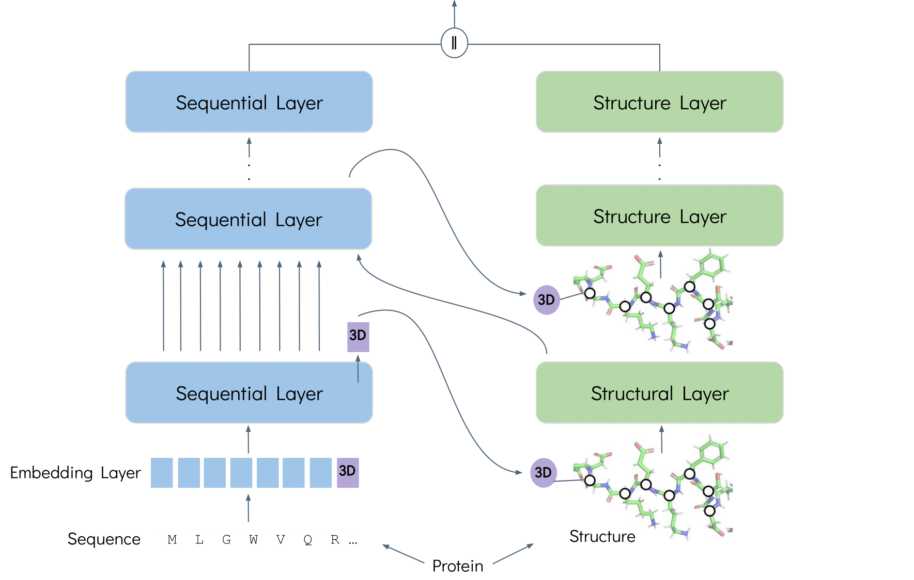

# FusionProt: Fusing Sequence and Structural Information for Unified Protein Representation Learning

### Dan Kalifa, Uriel Singer and Kira Radinsky

> **Abstract:** Accurate protein representations that integrate sequence and three-dimensional (3D) structure are critical to many biological and biomedical tasks. Most existing models either ignore structure or combine it with sequence through a single, static fusion step. Here we present FusionProt, a unified model that learns representations via iterative, bidirectional fusion between a protein language model and a structure encoder. A single learnable token serves as a carrier, alternating between sequence attention and spatial message passing across layers.
FusionProt is evaluated on Enzyme Commission (EC), Gene Ontology (GO), and mutation stability prediction tasks using family-level splits ($\leq$30\% sequence identity). It improves F\textsubscript{max} by a median of \(+\)1.3 points (up to \(+\)2.0) across EC and GO benchmarks, and boosts AUROC by \(+\)3.6 points over the strongest baseline on mutation stability. Inference cost remains practical, with only \(\sim\)2–5\% runtime overhead. Attribution analyses highlight catalytic and ligand-contacting residues, indicating that the model captures biologically relevant features.

The FusionProt pre-training architecture:


This repository provides a reference implementation of FusionProt and baselines as described in the paper.

Some code was borrowed from [ESM-GearNet](https://github.com/DeepGraphLearning/ESM-GearNet).

We publish the [FusionProt](https://drive.google.com/file/d/10RjzOc3N4uBFQflr1pXV_DgJT45ogiln/view?usp=sharing) model's weights, trained with a Multiview Contrast objective.


## Installation

You may install the dependencies via pip. Generally, FusionProt works
with Python 3.8 and PyTorch version >= 1.12.0. 
Note: Replace the cuda version with your cuda version (e.g., cuda 11.6).

```bash
pip install torch==1.12.1+cu116 torchvision==0.13.1+cu116 torchaudio==0.12.1 --extra-index-url https://download.pytorch.org/whl/cu116
pip install torch-scatter==2.1.0 torch-sparse==0.6.16 torch-cluster==1.6.0 torch-spline-conv==1.2.1 torch-geometric==2.2.0 -f https://data.pyg.org/whl/torch-1.12.1+cu116.html
pip install torchdrug
pip install easydict pyyaml
pip install atom3d
pip install transformers==4.14.1 tokenizers==0.10.3
pip install wandb   # login to https://wandb.ai/ and do wandb login in your terminal
```

## Reproduction

### Training From Scratch

To reproduce the results of FusionProt, and pre-train FusionProt with Multiview Contrast, use the following command (other objective function available in the config).
Alternatively, you may reset the `gpus` parameter in configure files to switch to other GPUs.
By default, we will use the AlphaFold2 Database for pretraining.
All the relevant datasets will be automatically downloaded in the code. 
It takes longer time to run the code for the first time due to the preprocessing time of the dataset.

```bash
# Run pre-training
python -m torch.distributed.launch --nproc_per_node=4 script/pretrain.py -c config/pretrain/mc_esm_gearnet.yaml
```

### Fine-tuning

After pre-training, you can load the model weight from the saved checkpoint via the `--ckpt` argument and then finetune the model on downstream tasks.
**Remember to first uncomment the ``model_checkpoint: {{ ckpt }}` line in the config file.**

```bash
python -m torch.distributed.launch --nproc_per_node=4 script/downstream.py -c config/EC/3d_esm_gearnet.yaml --ckpt <path_to_your_model>
```

### Fine-tuning (without pre-training)

```bash
# Run FusionProt on the Enzyme Comission dataset with 4 gpus
python -m torch.distributed.launch --nproc_per_node=4 script/downstream.py -c config/EC/3d_esm_gearnet.yaml

# Run FusionProt on the Gene Ontology dataset (pick the relevant branch - MF / BP / CC)
python -m torch.distributed.launch --nproc_per_node=4 script/downstream.py -c config/GO/3d_esm_gearnet.yaml --branch MF
```
