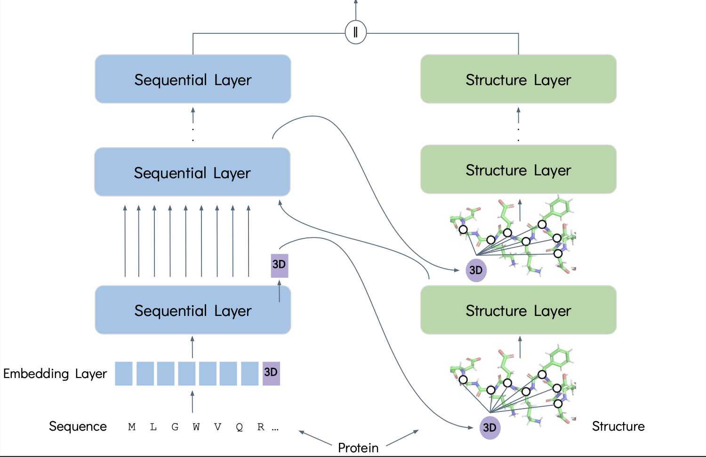

# 3DProtLM: Leveraging Protein 3D Structures for Protein Representation Learning

### Dan Kalifa, Uriel Singer and Kira Radinsky

#### In Proceedings of the 31th ACM SIGKDD Conference on Knowledge Discovery and Data Mining (KDD '25), August 3-7, 2025, Toronto, ON, Canada.

> **Abstract:** Proteins play a crucial role in biological processes and understanding the complex mechanisms within living organisms. Accurate protein representation is vital for advancements in drug development, synthetic biology, and understanding disease mechanisms. Current methodologies primarily focus on one-dimensional (1D) structures, emphasizing amino acid sequences. However, this approach neglects the essential three-dimensional (3D) structural details that determine protein functionality and interactions. To address this limitation, we introduce 3DProtLM, a novel approach designed to learn unified representations of both the 1D and 3D structures of proteins simultaneously. Utilizing AlphaFold2 for accurate 3D structure predictions, 3DProtLM incorporates a specialized learnable 3D structure token that propagates structural features throughout the training process of a protein language model. This token is integrated into the protein's 3D structure graph, facilitating comprehensive representation through iterative learning cycles. Empirical evaluations across various biological tasks demonstrate that 3DProtLM achieves state-of-the-art (SOTA) performance, offering a significant advancement in protein representation learning.

The 3DProtLM pre-training architecture:


This repository provides a reference implementation of 3DProtLM and baselines as described in the paper.

Some code was borrowed from [ESM-GearNet](https://github.com/DeepGraphLearning/ESM-GearNet).

We publish the [3DProtLM](TBD-URL) model's weights, trained with the multiview contrast objective.


## Installation

You may install the dependencies via pip. Generally, 3DProtLM works
with Python 3.8 and PyTorch version >= 1.12.0. 
Note: Replace the cuda version with your cuda version (e.g., cuda 11.6).

```bash
pip install torch==1.12.1+cu116 torchvision==0.13.1+cu116 torchaudio==0.12.1 --extra-index-url https://download.pytorch.org/whl/cu116
pip install torch-scatter==2.1.0 torch-sparse==0.6.16 torch-cluster==1.6.0 torch-spline-conv==1.2.1 torch-geometric==2.2.0 -f https://data.pyg.org/whl/torch-1.12.1+cu116.html
pip install torchdrug
pip install easydict pyyaml
pip install atom3d
pip install transformers==4.14.1 tokenizers==0.10.3
pip install wandb   # login to https://wandb.ai/ and do wandb login in your terminal
```

## Reproduction

### Training From Scratch

To reproduce the results of 3DProtLM, and pre-train 3DProtLM with Multiview Contrast, use the following command (other objective function available in the config).
Alternatively, you may reset the `gpus` parameter in configure files to switch to other GPUs.
By default, we will use the AlphaFold Database for pretraining.
All the relevant datasets will be automatically downloaded in the code. 
It takes longer time to run the code for the first time due to the preprocessing time of the dataset.

```bash
# Run pre-training
python -m torch.distributed.launch --nproc_per_node=4 script/pretrain.py -c config/pretrain/mc_esm_gearnet.yaml
```

### Fine-tuning

After pre-training, you can load the model weight from the saved checkpoint via the `--ckpt` argument and then finetune the model on downstream tasks.
**Remember to first uncomment the ``model_checkpoint: {{ ckpt }}` line in the config file.**

```bash
python -m torch.distributed.launch --nproc_per_node=4 script/downstream.py -c config/EC/3d_esm_gearnet.yaml --ckpt <path_to_your_model>
```

### Fine-tuning (without pre-training)

```bash
# Run 3DProtLM on the Enzyme Comission dataset with 4 gpus
python -m torch.distributed.launch --nproc_per_node=4 script/downstream.py -c config/EC/3d_esm_gearnet.yaml

# Run 3DProtLM on the Gene Ontology dataset (pick the relevant branch - MF / BP / CC)
python -m torch.distributed.launch --nproc_per_node=4 script/downstream.py -c config/GO/3d_esm_gearnet.yaml --branch MF
```
